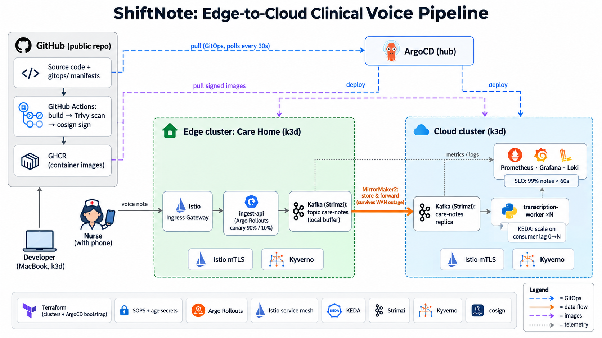

# ShiftNote

An edge-to-cloud GitOps demo for a clinical voice documentation pipeline, running locally on two k3d clusters.



## Components

- **Clusters:** k3d ×2 (`edge`, `cloud`) on one Docker network
- **Provisioning:** Terraform (`01-clusters`, then `02-bootstrap`)
- **GitOps:** ArgoCD in `cloud`, managing both clusters
- **Mesh / delivery:** Istio, Argo Rollouts
- **Messaging / scaling:** Strimzi Kafka + MirrorMaker2, KEDA
- **Security:** Kyverno, cosign, SOPS + age
- **Observability:** kube-prometheus-stack, Loki

## Repository layout

```
terraform/
  01-clusters/     Docker network + k3d clusters
  02-bootstrap/    ArgoCD, edge cluster registration, root app
apps/              ingest-api (edge), transcription-worker (cloud)
gitops/
  apps/            App-of-apps entry point
  platform/        Platform components
  workloads/       Application manifests (image tags bumped by CI)
.github/workflows/ Build arm64 images, push to GHCR, bump tags
```

## Prerequisites (macOS, Apple Silicon)

```bash
brew install podman k3d tfenv kubectl
tfenv install    # reads .terraform-version
```

k3d needs a **rootful** Podman machine with at least **16 GB** of memory and a Docker-compatible socket:
```bash
podman machine stop
podman machine set --rootful --memory 16384 --cpus 8
sudo "$(brew --prefix)/bin/podman-mac-helper" install   # creates /var/run/docker.sock
podman machine start

# add to ~/.zshrc
export DOCKER_HOST=unix:///var/run/docker.sock
export DOCKER_SOCK=/run/podman/podman.sock   # socket path inside the Podman VM, used by k3d
```
Check: `podman info --format '{{.Host.Security.Rootless}}'` prints `false`, and `k3d cluster list` runs without errors.

Docker Desktop or OrbStack also work; for those, only the 16 GB memory limit applies.

## Quick start

**1. Fork this repo** and point the manifests at your fork:
```bash
grep -rl musaibkhan/devops-demo . --exclude-dir=.git | xargs sed -i '' 's#musaibkhan/devops-demo#<you>/<your-fork>#g'
git commit -am "Point to my fork" && git push
```

**2. Create the clusters**
```bash
cd terraform/01-clusters
terraform init && terraform apply
```
Check: `kubectl get nodes --context k3d-cloud` and `kubectl get nodes --context k3d-edge` should each show one Ready node.

**3. Bootstrap ArgoCD**
```bash
cd ../02-bootstrap
cp terraform.tfvars.example terraform.tfvars   # optional: repo_url defaults to this repo
terraform init && terraform apply
```

**4. Verify.** Run the two commands from `terraform output`, open http://localhost:8081 and log in as `admin`. You should see:
- `root` → Synced
- `in-cluster-namespaces` and `edge-namespaces` → Synced/Healthy

```bash
kubectl get ns shiftnote kafka --context k3d-edge
```

## Platform components

After bootstrap, ArgoCD installs Istio, Argo Rollouts and Kyverno on both clusters, and the monitoring stack (Prometheus, Grafana, Loki, Alloy) on `cloud`. This takes about 5 minutes.

Grafana:
```bash
kubectl --context k3d-cloud -n monitoring port-forward svc/kube-prometheus-stack-grafana 3000:80
kubectl --context k3d-cloud -n monitoring get secret kube-prometheus-stack-grafana -o jsonpath='{.data.admin-password}' | base64 -d; echo
```
Open http://localhost:3000 (user `admin`).

## Applications

CI builds the images on every push to `apps/` and commits the new tags to `gitops/workloads/`; ArgoCD deploys them. After the first CI run, make both GHCR packages public (GitHub → your profile → Packages → package → Settings → Change visibility) so the clusters can pull them.

Send a note to the edge:
```bash
curl -s -X POST http://ingest.localhost:9080/notes \
  -H 'content-type: application/json' \
  -d '{"room": "12", "audio_b64": "ZGVtbw=="}'
```
It is queued in edge Kafka, mirrored to the cloud, and picked up by a transcription worker:
```bash
kubectl --context k3d-cloud -n shiftnote logs -l app=transcription-worker -c worker -f
```

## Demos

**Canary with automatic rollback.** Run `./scripts/traffic.sh`. In `gitops/workloads/edge/ingest-api.yaml`, change `APP_VERSION` to `v2` and push: traffic shifts 20% → 50% → 100%. Then set `APP_VERSION: v3` and `ERROR_RATE: "0.5"` and push. The analysis sees the error rate on the canary and aborts, and traffic returns to v2. Revert the commit to clear it.
```bash
kubectl argo rollouts get rollout ingest-api -n shiftnote --context k3d-edge -w   # optional plugin
```

**Shift-change burst.** `./scripts/burst.sh 600` queues 600 notes. KEDA scales the workers on consumer lag, up to 6, then back down.
```bash
kubectl --context k3d-cloud -n shiftnote get hpa,pods -w
```

**WAN outage.** `./scripts/wan.sh down` cuts the link between the sites. Notes are still accepted at the edge but stop arriving in the cloud. `./scripts/wan.sh up` restores it, and MirrorMaker2 delivers the backlog.

## Teardown

Run `terraform destroy` in `02-bootstrap`, then in `01-clusters`.
